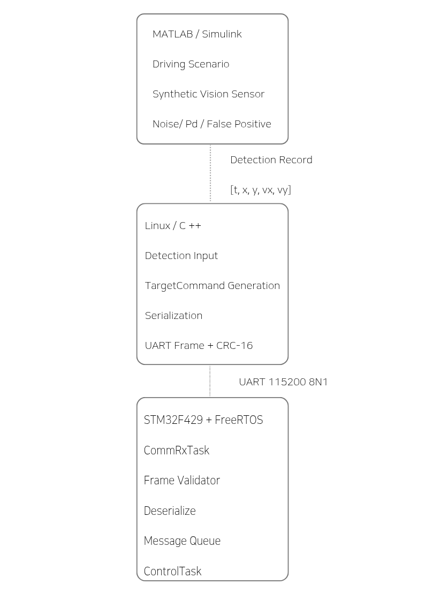
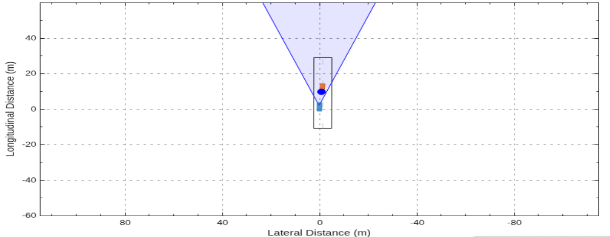
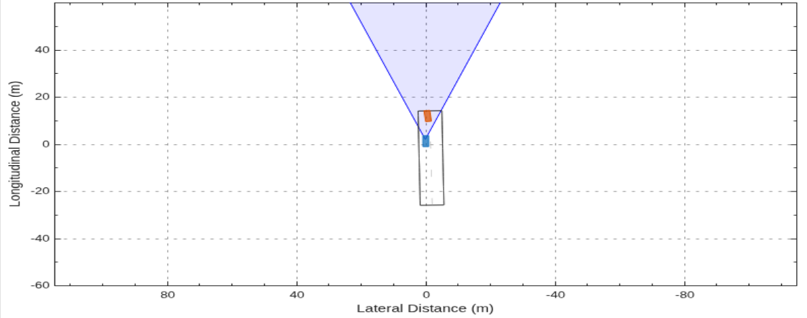
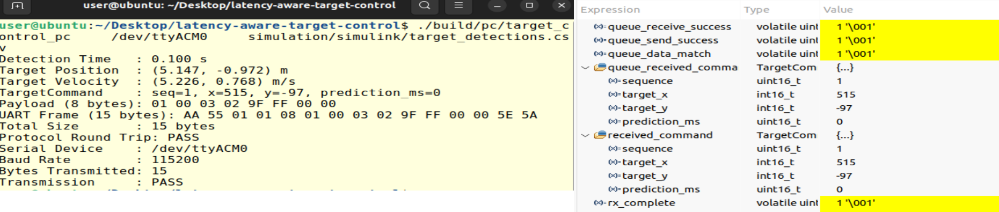

# Latency-Aware Target Control

## Project Description

Latency-Aware Target Control is an embedded system integration project that connects synthetic vehicle perception on MATLAB/Simulink with a Linux C++ application and an STM32F429 real-time controller.

The current implementation validates the complete data path from synthetic vision detection to `TargetCommand` reception inside a FreeRTOS `ControlTask`. Based on this validated path, the project is being extended toward end-to-end latency measurement and actuation-time-aligned target prediction.

<p align="center">
  
</p>

<p align="center">
  <em>System architecture from synthetic vision sensing to Linux command generation and STM32/FreeRTOS control.</em>
</p>


## Overview

The system models a two-layer control architecture:

- **Linux / High-Level Processing:** perception input processing, command generation, protocol encoding, and UART transmission
- **STM32 / Real-Time Local Control:** frame validation, command reconstruction, RTOS communication, and control-side execution

A controlled vehicle scenario is generated using MATLAB/Simulink and Automated Driving Toolbox. `Vision Detection Generator` produces synthetic target detections with configurable measurement noise, detection probability, and false positives.

Detection time, position, and velocity are extracted as:

```text
[time, x, y, vx, vy]
```

The current Simulink-to-Linux integration uses a CSV file as a reproducible interface. The Linux application converts the detection into a `TargetCommand`, serializes it into an 8-byte payload, encapsulates it in a CRC-16 protected UART frame, and transmits the frame to the STM32.

On the STM32F429, `CommRxTask` validates and deserializes the frame before sending the reconstructed command through a CMSIS-RTOS2 message queue to `ControlTask`.

The following path has been validated on actual hardware:

```text
MATLAB / Simulink
    ↓
Synthetic Vision Detection
    ↓
Linux C++
    ↓
TargetCommand
    ↓
UART
    ↓
STM32F429 + FreeRTOS
    ↓
ControlTask
```


## Motivation / Problem Definition

A target position is valid when it is observed, but a physical actuator cannot respond at that same instant.

In a distributed control system, target information passes through multiple stages before control is applied:

```text
Perception
    ↓
High-Level Processing
    ↓
Command Generation
    ↓
Communication
    ↓
MCU Scheduling
    ↓
Control Execution
    ↓
Physical Actuation
```

During this interval, a moving target continues to change its position. Therefore, a command generated directly from the latest detected position can already be stale when actuation occurs.

```text
Target state measured at t0
        ↓
Processing + Communication + Scheduling Delay
        ↓
Control applied at t0 + Δt
```

For a moving target:

```text
Target Position at t0 ≠ Target Position at t0 + Δt
```

This project treats the perception-to-actuation delay as a system-level control problem.

The intended latency-aware strategy combines target position, target velocity, and measured latency to estimate the target state at the expected actuation time.

```text
Current Target Position
        +
Target Velocity
        +
Measured Latency
        ↓
Predicted Future Target Position
        ↓
Control Command
```

For a constant-velocity target, the basic prediction model is:

```text
x_future = x_detected + vx × Δt
y_future = y_detected + vy × Δt
```

The final evaluation will compare:

- **Baseline:** control using the latest detected target position
- **Latency-Aware:** control using the predicted target position at the expected actuation time

The effectiveness of the latency-aware approach will be evaluated quantitatively using tracking error.


## System Architecture

The system is divided into three functional layers.

### 1. Simulation & Synthetic Sensing

MATLAB/Simulink and Automated Driving Toolbox provide a controlled and reproducible perception input.

The simulation layer generates:

- Detection timestamp
- Target position
- Target velocity
- Measurement noise
- Probabilistic detections
- False-positive detections

The extracted detection state is exported as:

```text
[time, x, y, vx, vy]
```

### 2. Linux High-Level Processing

The Linux C++ application is responsible for:

- Reading the synthetic detection record
- Converting physical coordinates into command units
- Constructing a `TargetCommand`
- Serializing the command into a fixed wire format
- Encoding the UART frame
- Generating and verifying CRC-16
- Transmitting the frame through a POSIX serial interface

The current baseline uses the latest detected position without future-position compensation. Detection time and target velocity are retained for the latency-aware prediction stage.

### 3. STM32 Real-Time Local Controller

The STM32F429I-DISC1 runs FreeRTOS through CMSIS-RTOS2.

Two tasks separate communication from control-side processing:

- **`CommRxTask`**
  - Receives the UART frame
  - Validates protocol fields and CRC
  - Deserializes the `TargetCommand`
  - Sends the command to the RTOS message queue

- **`ControlTask`**
  - Waits for a valid command
  - Receives it through `targetCommandQueue`
  - Performs control-side processing

This separation keeps high-level perception and command generation on Linux while the STM32 handles communication validation and real-time task execution.


## Simulation & Synthetic Sensor

The current simulation uses a constant-velocity scenario with an ego vehicle and a moving target vehicle.

`Scenario Reader` provides the ground-truth actor states, while `Vision Detection Generator` models a non-ideal vision sensor.

### Sensor Configuration

| Parameter | Value |
|---|---|
| Detection probability | `0.70` |
| False positives per image | `1.0` |
| Measurement noise | Enabled |
| Random seed | `42` |
| Sensor update interval | `0.1 s` |
| Detection coordinate system | Ego Cartesian |

A fixed random seed is used to make the probabilistic sensor behavior reproducible.

### Measurement Noise

The synthetic measurement does not perfectly overlap the ground-truth target position.

<p align="center">
  
</p>

<p align="center">
  <em>Ground-truth target and noisy synthetic vision detection.</em>
</p>

### False Positive

The sensor can generate a detection where no target vehicle exists.

<p align="center">
  
</p>

<p align="center">
  <em>False-positive detection generated independently of the actual target vehicle.</em>
</p>

### Missed Detection

Because the detection probability is below `1.0`, the target can remain inside the sensor field of view without generating a corresponding detection.

<p align="center">
  
</p>

<p align="center">
  <em>Target vehicle present in the scenario while the synthetic detector misses the target.</em>
</p>

### Detection Data Extraction

The vision detection output is logged from Simulink and filtered using the target actor ID.

For each valid target detection, the following values are extracted:

```text
time_sec
target_x
target_y
target_vx
target_vy
```

In Ego Cartesian coordinates, the sensor measurement contains:

```text
[x, y, z, vx, vy, vz]
```

The current Linux interface uses:

```text
[time, x, y, vx, vy]
```

The extracted records are exported to:

```text
simulation/simulink/target_detections.csv
```

This provides a reproducible perception input for system integration before introducing a physical camera.


## Linux / Protocol Design

The Linux application forms the boundary between synthetic perception and the STM32 controller.

### Detection Record

The current Simulink-to-Linux interface contains:

| Field | Description | Unit |
|---|---|---|
| `time_sec` | Detection timestamp | s |
| `target_x` | Detected X position | m |
| `target_y` | Detected Y position | m |
| `target_vx` | Detected X velocity | m/s |
| `target_vy` | Detected Y velocity | m/s |

Example:

```text
time_sec,target_x,target_y,target_vx,target_vy
0.1,5.1475,-0.97212,5.2262,0.76785
```

The current command representation uses centimeters for target position.

```text
5.1475 m
   ↓ × 100
514.75 cm
   ↓ round
515
```

### TargetCommand

The application-level command shared between Linux and STM32 is:

| Field | Type | Size | Description |
|---|---|---:|---|
| `sequence` | `uint16_t` | 2 bytes | Command sequence number |
| `target_x` | `int16_t` | 2 bytes | Target X position |
| `target_y` | `int16_t` | 2 bytes | Target Y position |
| `prediction_ms` | `uint16_t` | 2 bytes | Prediction horizon |

The wire payload is fixed at 8 bytes:

```text
sequence      2 bytes
target_x      2 bytes
target_y      2 bytes
prediction_ms 2 bytes
```

All multi-byte values are serialized in Little Endian order.

The current baseline does not apply future-position compensation:

```text
prediction_ms = 0
```

Example:

```text
sequence      = 1
target_x      = 515
target_y      = -97
prediction_ms = 0
```

Serialized payload:

```text
01 00 03 02 9F FF 00 00
```

### UART Frame

The serialized payload is encapsulated in a CRC-protected UART frame.

| Field | Value | Size |
|---|---|---:|
| SOF1 | `0xAA` | 1 byte |
| SOF2 | `0x55` | 1 byte |
| Version | `0x01` | 1 byte |
| Message Type | `0x01` | 1 byte |
| Payload Length | `0x08` | 1 byte |
| Payload | `TargetCommand` | 8 bytes |
| CRC | CRC-16/CCITT-FALSE | 2 bytes |

```text
SOF1 | SOF2 | Version | Type | Length | Payload | CRC
 AA     55      01      01      08      8 B      2 B
```

Total frame size:

```text
15 bytes
```

CRC configuration:

```text
Polynomial = 0x1021
Init       = 0xFFFF
RefIn      = false
RefOut     = false
XorOut     = 0x0000
```

Known CRC test vector:

```text
"123456789" → 0x29B1
```

Validated frame example:

```text
AA 55 01 01 08 01 00 03 02 9F FF 00 00 5E 5A
```

Before transmission, the Linux application performs a local protocol round-trip:

```text
TargetCommand
    ↓
Serialize
    ↓
UART Frame Encode
    ↓
UART Frame Decode
    ↓
Deserialize
    ↓
Compare with Original Command
```

### Serial Transport

The Linux serial transport uses:

```text
Baud Rate : 115200
Data Bits : 8
Parity    : None
Stop Bits : 1
Mode      : Raw Serial
```

Typical device:

```text
/dev/ttyACM0
```

The transport layer is independent from the protocol layer. `SerialPort` handles raw byte transmission without interpreting `TargetCommand`, frame headers, or CRC fields.


## STM32 / FreeRTOS Architecture

The STM32F429I-DISC1 acts as the real-time local controller.

The receive path is:

```text
USART1
  ↓
CommRxTask
  ↓
UART Frame Validator
  ↓
TargetCommand Deserialize
  ↓
targetCommandQueue
  ↓
ControlTask
```

### CommRxTask

`CommRxTask` performs:

```text
HAL_UART_Receive()
    ↓
Frame Validation
    ↓
TargetCommand Deserialization
    ↓
osMessageQueuePut()
```

The task receives a complete 15-byte frame, validates it, reconstructs the `TargetCommand`, and sends the command to the RTOS message queue.

It does not directly execute control logic.

### ControlTask

`ControlTask` performs:

```text
osMessageQueueGet()
    ↓
TargetCommand Receive
    ↓
Local Control Processing
```

The task blocks until a new command becomes available.

### Message Queue

| Item | Configuration |
|---|---|
| Producer | `CommRxTask` |
| Consumer | `ControlTask` |
| Queue | `targetCommandQueue` |
| Item Type | `TargetCommand` |
| Capacity | 4 commands |
| API | CMSIS-RTOS2 Message Queue |

Queue creation:

```c
osMessageQueueNew(
    4,
    sizeof(TargetCommand),
    &targetCommandQueue_attributes
);
```

The queue provides an explicit boundary between communication processing and control execution.

### Frame Validation

Before a command enters the control path, the frame is checked for:

- Frame length
- Start-of-frame bytes
- Protocol version
- Message type
- Payload length
- CRC-16

Only a valid frame is deserialized and sent to `targetCommandQueue`.


## End-to-End Data Flow

One actual synthetic detection was propagated through the complete integration path.

### Synthetic Detection

```text
time = 0.100 s
x    = 5.147 m
y    = -0.972 m
vx   = 5.226 m/s
vy   = 0.768 m/s
```

### Linux Command

After position conversion:

```text
TargetCommand
├── sequence      = 1
├── target_x      = 515
├── target_y      = -97
└── prediction_ms = 0
```

Serialized payload:

```text
01 00 03 02 9F FF 00 00
```

UART frame:

```text
AA 55 01 01 08 01 00 03 02 9F FF 00 00 5E 5A
```

### STM32 / FreeRTOS

After UART validation and deserialization:

```text
received_command
├── sequence      = 1
├── target_x      = 515
├── target_y      = -97
└── prediction_ms = 0
```

After the RTOS message queue:

```text
queue_received_command
├── sequence      = 1
├── target_x      = 515
├── target_y      = -97
└── prediction_ms = 0
```

Validated path:

```text
Synthetic Detection
    ↓
Linux C++
    ↓
TargetCommand
    ↓
UART Frame + CRC-16
    ↓
STM32 CommRxTask
    ↓
Frame Validation / Deserialization
    ↓
FreeRTOS Message Queue
    ↓
ControlTask
```


## Validation

Validation is performed at the protocol, simulation, and hardware-integration levels.

### Host-Side Tests

Host-side verification covers:

- `TargetCommand` serialization / deserialization
- CRC-16/CCITT-FALSE
- UART frame encoding / decoding
- UART frame validation
- Linux serial transport

The generated command also passes a protocol round-trip before transmission.

### Synthetic Sensor Validation

The simulation verifies:

- Measurement noise
- Probabilistic detection
- False positives
- Missed detections
- Detection time / position / velocity extraction

### End-to-End Hardware Validation

The following image shows the same command on the Linux host and after reception and queue transfer on the STM32.

<p align="center">
  
</p>

<p align="center">
  <em>Linux transmission and STM32/FreeRTOS reception of the same TargetCommand.</em>
</p>

Observed result:

```text
Linux TargetCommand
{ sequence=1, target_x=515, target_y=-97, prediction_ms=0 }

            ↓ UART

STM32 received_command
{ sequence=1, target_x=515, target_y=-97, prediction_ms=0 }

            ↓ FreeRTOS Queue

queue_received_command
{ sequence=1, target_x=515, target_y=-97, prediction_ms=0 }
```

Integration flags:

```text
rx_complete             = 1
queue_send_success      = 1
queue_receive_success   = 1
queue_data_match        = 1
```

Validation summary:

| Verification | Result |
|---|---|
| Host protocol round-trip | **PASS** |
| Linux serial transmission | **PASS** |
| STM32 UART reception | **PASS** |
| UART frame validation | **PASS** |
| TargetCommand deserialization | **PASS** |
| FreeRTOS queue send / receive | **PASS** |
| Command integrity across queue boundary | **PASS** |

Overall validated path:

```text
Simulink → Linux → UART → STM32 → FreeRTOS Queue → ControlTask
```

**Result: PASS**


## Build & Run

### Build

```bash
cmake -S . -B build
cmake --build build -j
```

Run host-side tests:

```bash
ctest --test-dir build --output-on-failure
```

### Generate Synthetic Detection Data

Open:

```text
simulation/simulink/scenario_sensor_model.slx
```

MATLAB workflow:

```text
Run scenario_sensor_model.slx
    ↓
Run extract_target_detections
    ↓
Generate target_detections.csv
```

Generated file:

```text
simulation/simulink/target_detections.csv
```

### Run Linux Application

```bash
./build/pc/target_control_pc \
    /dev/ttyACM0 \
    simulation/simulink/target_detections.csv
```

The current bring-up application reads the first valid detection record, constructs one `TargetCommand`, performs the protocol round-trip, and transmits the resulting 15-byte frame to the STM32.


## Repository Structure

```text
.
├── common/
│   ├── include/protocol/    # Shared protocol definitions
│   └── src/                 # Shared protocol implementation
│
├── pc/
│   ├── include/
│   │   ├── input/           # Detection input interface
│   │   └── transport/       # Linux serial transport
│   └── src/                 # Linux C++ application
│
├── simulation/
│   └── simulink/            # Driving scenario and synthetic sensor model
│
├── tests/                   # Host-side unit tests
│
└── docs/
    └── images/              # Architecture and validation images
```

Protocol sources under `common/` are shared between the Linux host and STM32 firmware, maintaining a single source of truth for serialization, CRC, UART framing, and frame validation.


## Current Status

### Implemented

- ✅ `TargetCommand` wire format
- ✅ Serialization / deserialization
- ✅ CRC-16/CCITT-FALSE
- ✅ UART frame encoding / decoding / validation
- ✅ Linux serial transport
- ✅ Host-side unit tests
- ✅ STM32 UART reception
- ✅ FreeRTOS task scheduling
- ✅ CMSIS-RTOS2 message queue communication
- ✅ Driving scenario generation
- ✅ Synthetic vision sensor integration
- ✅ Measurement noise
- ✅ Probabilistic detection
- ✅ False-positive and missed detections
- ✅ Detection time / position / velocity extraction
- ✅ Simulink detection record → Linux C++ integration
- ✅ Linux → UART → STM32 communication
- ✅ STM32 frame validation and deserialization
- ✅ `CommRxTask` → Message Queue → `ControlTask`
- ✅ Simulink → Linux → STM32 → FreeRTOS end-to-end validation

### In Progress

- ⏳ End-to-end latency instrumentation
- ⏳ Latency-aware future target prediction
- ⏳ PWM / servo actuation
- ⏳ Baseline vs. latency-aware tracking-error evaluation


## Roadmap

| Phase | Description | Status |
|---|---|---|
| Phase 1 | Communication Protocol & RTOS Path | ✅ Complete |
| Phase 2 | Synthetic Sensor Integration | ✅ Complete |
| Phase 3 | End-to-End Latency Instrumentation | ⏳ In Progress |
| Phase 4 | Latency-Aware Target Prediction | ⏳ Planned |
| Phase 5 | PWM / Servo Actuation | ⏳ Planned |
| Phase 6 | Quantitative Baseline Comparison | ⏳ Planned |

The final evaluation will compare baseline tracking error against latency-aware prediction under identical target-motion and latency conditions.


## Tech Stack

### Embedded / Real-Time

- STM32F429I-DISC1
- FreeRTOS
- CMSIS-RTOS2
- STM32 HAL
- UART

### Linux / Application

- C
- C++17
- CMake
- CTest
- Ubuntu Linux
- POSIX Serial / `termios`

### Simulation

- MATLAB R2026a
- Simulink
- Automated Driving Toolbox