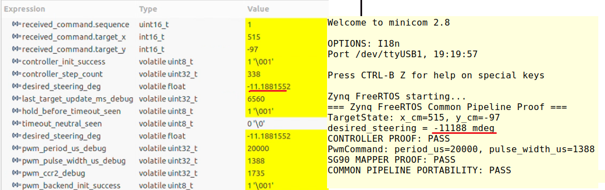

# Latency-Aware Target Control

### Hardware-Independent Control Software Across STM32 and Zynq

An embedded control integration project that separates **application semantics** from **platform mechanisms**, allowing the same control and actuator-mapping sources to run across heterogeneous processors.

The project connects MATLAB/Simulink synthetic perception to a Linux C++ application and an STM32/FreeRTOS control runtime. The shared steering controller and SG90 mapper are also built and executed on Zynq-7000 PS with FreeRTOS, without modifying their common source code.

> **Take 11 milestone — 2026-08-28:** Zybo Z7-10 PS with FreeRTOS successfully ran the exact shared common controller and SG90 mapper via symlink, with zero common-source modifications.

## 1. Results at a Glance

| Item                                        | Verified result                                                             |
| ------------------------------------------- | --------------------------------------------------------------------------- |
| Shared-source portability                   | Same `steering_controller.c` and `sg90_mapper.c` executed on STM32 and Zynq |
| Common-source modifications during the port | **0 LOC**                                                                   |
| Reference platform                          | STM32F429 / Cortex-M4 / FreeRTOS                                            |
| Portability platform                        | Zybo Z7-10 / Zynq-7000 PS / Cortex-A9 / FreeRTOS                            |
| Deterministic comparison input              | `TargetState { x_cm = 515, y_cm = -97 }`                                    |
| Steering output                             | Approximately **−11.188°** on both platforms                                |
| Generic PWM output                          | **20,000 μs period / 1,388 μs pulse width** on both platforms               |
| STM32 software actuation path               | Verified through the PWM backend and TIM4_CH2/PB7 timer configuration       |
| Host tests                                  | **7/7 CTest targets passed**                                                |

The project began with a latency-aware target-control problem. Its current focus is hardware abstraction and portability: preserving control behavior while replacing the platform runtime and peripheral backend.

## 2. System Architecture


The STM32 reference path connects:

**Simulink synthetic perception → UDP → Linux C++ → UART/CRC-16 → STM32 runtime → TargetState → common steering controller → SG90 mapper → PwmCommand → STM32 PWM backend**

The Zynq proof supplies a deterministic `TargetState` locally and executes the same common controller and mapper under FreeRTOS.

### Layer Responsibilities

| Layer                      | Responsibility                                                                       |
| -------------------------- | ------------------------------------------------------------------------------------ |
| MATLAB/Simulink            | Generate synthetic detections and filter the selected target actor                   |
| Linux C++                  | Receive detections, convert units, construct commands, and transmit UART frames      |
| Platform runtime           | Receive bytes, manage tasks and queues, acquire time, and schedule control execution |
| Common protocol            | Validate frames and CRC, serialize and deserialize transport data                    |
| Common steering controller | Apply target validation, steering calculation, limits, and timeout behavior          |
| SG90 mapper                | Convert a steering angle into a generic PWM command                                  |
| Platform PWM backend       | Convert physical PWM units into peripheral-specific settings                         |

The steering controller has no dependency on UART, FreeRTOS, CMSIS-RTOS2, STM32 HAL, Zynq BSP, or timer registers.

The SG90 mapper contains actuator-specific mapping rules, but no platform-specific peripheral access.

## 3. Design Decisions

### Semantic Input Instead of Transport Metadata

The UART protocol transports a `TargetCommand`, while the controller receives only the target position:

```c
typedef struct
{
    int16_t x_cm;
    int16_t y_cm;
} TargetState;
```

The platform runtime extracts this semantic input from the decoded command. Sequence numbers and prediction metadata do not enter the common control application.

Coordinate and steering conventions:

| Quantity          | Convention |
| ----------------- | ---------- |
| `+x`              | Forward    |
| `+y`              | Left       |
| `−y`              | Right      |
| Positive steering | Left       |
| Negative steering | Right      |
| Zero steering     | Neutral    |

### Runtime-Owned Time and Scheduling

The common controller receives `now_ms` from its caller. It does not acquire time through `HAL_GetTick()`, `osKernelGetTickCount()`, or `xTaskGetTickCount()`.

Each platform runtime is responsible for converting its local clock into milliseconds and providing the execution schedule.

This separates asynchronous target arrival from periodic control execution.

### Steering, Actuator Mapping, and PWM Hardware

The controller produces a steering angle in degrees. The SG90 mapper converts that angle into:

```c
typedef struct
{
    uint32_t period_us;
    uint32_t pulse_width_us;
} PwmCommand;
```

The PWM backend converts these physical units into timer settings.

Servo mounting direction and pulse calibration belong to mapper configuration. Timer clocks, prescalers, channels, and registers belong to the platform backend.

## 4. Simulation and Input Pipeline

MATLAB/Simulink and Automated Driving Toolbox provide a controlled perception source containing an ego vehicle and a moving target.

### Synthetic Sensor Configuration

| Parameter                 | Configuration              |
| ------------------------- | -------------------------- |
| Sensor block              | Vision Detection Generator |
| Detection probability     | `0.70`                     |
| False positives per image | `1.0`                      |
| Measurement noise         | Enabled                    |
| Random seed               | `42`                       |
| Sensor update interval    | `0.1 s`                    |
| Coordinate system         | Ego Cartesian              |
| Selected target actor     | `targetActorId = 2`        |

The input includes measurement noise, false positives, and missed detections.

Detections for other actors and false positives are filtered out. If the selected target is not detected, no new packet is transmitted; a missing detection is not converted into a zero-valued target.

Representative synthetic-sensor visualization frames:


### Live UDP and CSV Input

The Linux application supports two input sources that produce the same `DetectionRecord`:

| Mode | Input source            | Purpose                                      |
| ---- | ----------------------- | -------------------------------------------- |
| Live | Simulink → UDP receiver | Live synthetic-perception integration        |
| CSV  | Recorded detection file | Deterministic replay and debugger inspection |

The live packet contains five little-endian doubles:

```text
[time_sec, x_m, y_m, vx_mps, vy_mps]
```

| Transport setting | Value       |
| ----------------- | ----------- |
| UDP address       | `127.0.0.1` |
| UDP port          | `51001`     |
| Packet encoding   | `<5d`       |
| Packet size       | `40 bytes`  |

The Simulink Python Code block acts as the UDP transport adapter. Control and actuator logic execute downstream.

## 5. Communication Contract

### TargetCommand Payload

| Field           | Type       | Size    | Current role                    |
| --------------- | ---------- | -------:| ------------------------------- |
| `sequence`      | `uint16_t` | 2 bytes | Protocol/debug metadata         |
| `target_x`      | `int16_t`  | 2 bytes | Forward position in centimeters |
| `target_y`      | `int16_t`  | 2 bytes | Lateral position in centimeters |
| `prediction_ms` | `uint16_t` | 2 bytes | Retained field; currently `0`   |

The fixed wire payload is **8 bytes**, with explicit little-endian serialization.

Linux converts positions from meters to centimeters. For example, a detection near `(5.147 m, −0.972 m)` produces `(515 cm, −97 cm)`.

The current controller uses target position only. `prediction_ms` does not implement latency compensation or future-target prediction.

### UART Frame

| Field          | Value                      | Size    |
| -------------- | -------------------------- | -------:|
| SOF            | `0xAA 0x55`                | 2 bytes |
| Version        | `0x01`                     | 1 byte  |
| Message type   | `0x01`                     | 1 byte  |
| Payload length | `0x08`                     | 1 byte  |
| Payload        | Serialized `TargetCommand` | 8 bytes |
| CRC            | CRC-16/CCITT-FALSE         | 2 bytes |

**Total frame size: 15 bytes**

Serial configuration: **115200 baud, 8 data bits, no parity, 1 stop bit**.

CRC parameters:

```text
Polynomial = 0x1021
Init       = 0xFFFF
RefIn      = false
RefOut     = false
XorOut     = 0x0000

Check vector:
"123456789" → 0x29B1
```

## 6. Common Steering Controller

The controller uses a Pure-Pursuit-inspired geometric steering law:

```text
delta = atan(2 × L × y / (x² + y²))
```

Here, `x`, `y`, and wheelbase `L` are expressed in meters. The resulting angle is converted to degrees and processed by the configured deadband and steering limits.

| Parameter              | Configuration                    |
| ---------------------- | -------------------------------- |
| Wheelbase              | `2.8 m`                          |
| Steering deadband      | `±1°`                            |
| Steering limits        | `±30°`                           |
| Invalid target rule    | Reject `x_cm <= 0`               |
| Target timeout         | Configurable timeout-to-neutral  |
| STM32 control schedule | Nominal `20 ms` period / `50 Hz` |

The behavior is:

1. Accept a valid target and record its update time.
2. Reject invalid targets without replacing the last valid target.
3. Retain the last valid target before timeout.
4. Return neutral steering after the configured timeout expires.

Protocol-invalid frames are rejected before reaching this semantic validation.

The controller API separates target updates from control evaluation:

```c
bool steering_controller_update_target(
    SteeringController *controller,
    const TargetState *target,
    uint32_t now_ms);

float steering_controller_step(
    const SteeringController *controller,
    uint32_t now_ms);
```

## 7. STM32 Runtime and PWM Backend

The reference platform is **STM32F429I-DISC1**, using FreeRTOS through CMSIS-RTOS2 and STM32 HAL.

### Task and Queue Ownership

| Component            | Responsibility                                                                                            |
| -------------------- | --------------------------------------------------------------------------------------------------------- |
| `CommRxTask`         | Receive UART data, invoke frame decoding, map commands to `TargetState`, and enqueue updates              |
| `targetCommandQueue` | Transport `TargetState` objects between tasks                                                             |
| `ControlTask`        | Own controller state, process target updates, evaluate steering, map PWM commands, and invoke the backend |

Despite its historical name, `targetCommandQueue` now stores **`TargetState`**, with an item size of `sizeof(TargetState)` and a capacity of four.

The control task runs on a nominal 20 ms schedule, independently of the sensor's 100 ms update interval.

### SG90 Mapping

The mapper supports configurable center and endpoint pulse widths, interpolation, clamping, and reversed mounting direction.

The documented provisional mapping is:

| Steering angle | Pulse width |
| -------------- | -----------:|
| `−30°`         | `1200 μs`   |
| `0°`           | `1500 μs`   |
| `+30°`         | `1800 μs`   |

These values support software testing and the current proof. They are not a completed physical servo calibration.

### Timer Backend

| Resource            | Configuration |
| ------------------- | ------------- |
| Timer/channel       | `TIM4_CH2`    |
| GPIO                | `PB7`         |
| Counter frequency   | `1.25 MHz`    |
| Timer tick duration | `0.8 μs`      |
| Period command      | `20000 μs`    |
| Period register     | `ARR = 24999` |

At this counter frequency:

```text
20000 μs → 25000 counts → ARR = 24999
 1500 μs →  1875 counts → CCR2 = 1875
 1388 μs →  1735 counts → CCR2 = 1735
```

`PwmCommand` values are in microseconds; timer register values are in counts. Their numerical values need not be equal.

## 8. Validation Evidence

### 8.1 Linux-to-STM32 Communication

The earlier communication milestone verified transmission of a known command through UART reception, frame validation, deserialization, and RTOS queue delivery.


This capture records the earlier `TargetCommand` queue implementation. The current runtime maps decoded commands to `TargetState` before queue delivery.

### 8.2 STM32–Zynq Common Pipeline Comparison

The following capture compares STM32 debugger values with the Zynq/FreeRTOS proof log.



| Quantity                | STM32          | Zynq                                |
| ----------------------- | --------------:| -----------------------------------:|
| Target input            | `{515, -97}`   | `{515, -97}`                        |
| Steering output         | `−11.1881552°` | `−11188 mdeg`                       |
| PWM period              | `20000 μs`     | `20000 μs`                          |
| PWM pulse width         | `1388 μs`      | `1388 μs`                           |
| PWM compare debug value | `1735 counts`  | Not part of the Zynq hardware proof |

The steering outputs agree at the precision displayed by the Zynq log. Both platforms produce the same integer-valued generic PWM command.

Recorded Zynq output:

```text
Zynq FreeRTOS starting...
=== Zynq FreeRTOS Common Pipeline Proof ===
TargetState: x_cm=515, y_cm=-97
desired_steering = -11188 mdeg
CONTROLLER PROOF: PASS
PwmCommand: period_us=20000, pulse_width_us=1388
SG90 MAPPER PROOF: PASS
COMMON PIPELINE PORTABILITY: PASS
```

### 8.3 Shared-Source Portability — Take 11

The proof runs on **Zybo Z7-10 / Zynq-7000 PS / Cortex-A9 / FreeRTOS**.

The Vitis application reuses:

- `common/src/steering_controller.c`
- `common/src/sg90_mapper.c`

The sources are linked through symlinks and compiled for Cortex-A9 without edits to the common implementations.

**Common-source modifications required for this port: 0 LOC.**

The Zynq application supplies the deterministic target locally. This milestone verifies common-logic execution and generic PWM-command generation; Zynq live UART input and hardware PWM output remain future integration work.

### 8.4 Hold and Timeout Behavior

A one-shot target update was used to observe steering retention followed by neutral recovery.

The STM32 debug latches recorded:

```text
hold_before_timeout_seen = 1
timeout_neutral_seen     = 1
```

The neutral-state capture also showed:

```text
desired_steering_deg      = 0
pwm_period_us_debug       = 20000
pwm_pulse_width_us_debug  = 1500
pwm_ccr2_debug            = 1875
```

### 8.5 Host Tests

The recorded host suite contains **seven CTest targets**, covering multiple test cases.

| Area                | Coverage                                                                                                 |
| ------------------- | -------------------------------------------------------------------------------------------------------- |
| Protocol            | Serialization/deserialization, CRC, frame encoding and validation                                        |
| Linux transport     | Serial transport behavior                                                                                |
| Steering controller | Center/sign, deadband, saturation, invalid input, hold, timeout, and invalid configuration               |
| SG90 mapper         | Center/limits, interpolation, clamping, reversed direction, invalid configuration, and invalid arguments |

Recorded suite result:

```text
100% tests passed, 0 tests failed out of 7
```

### Verification Scope

| Claim                                 | Current evidence                                                       |
| ------------------------------------- | ---------------------------------------------------------------------- |
| Live synthetic-perception integration | Simulink → UDP → Linux → STM32 integration                             |
| STM32 software actuation path         | Deterministic input traced through controller, mapper, and PWM backend |
| Common-source reuse on Zynq           | Same controller and mapper built and executed via symlink              |
| Cross-platform output agreement       | Deterministic `{515, -97}` comparison                                  |
| Physical PWM waveform accuracy        | Measurement pending                                                    |
| Calibrated physical servo angle       | Validation pending                                                     |
| Cross-platform timing equivalence     | Execution-time and jitter measurements pending                         |
| Closed-loop vehicle tracking          | Not implemented; no vehicle-state feedback to Simulink                 |

## 9. Build and Run

Run host commands from the repository root.

### Host Build and Tests

Requirements include a C/C++17 toolchain, CMake, and a Linux environment.

```bash
cmake -S . -B build
cmake --build build -j
ctest --test-dir build --output-on-failure
```

The host test suite does not require an attached board or a running Simulink model.

### STM32 Firmware

Open the following project in STM32CubeIDE:

```text
firmware/stm32/target_control_stm32
```

Build the firmware, download it to the board, and resume execution before sending commands from Linux.

### Deterministic CSV Input

```bash
./build/pc/target_control_pc \
    /dev/ttyACM0 \
    simulation/simulink/target_detections.csv
```

This input mode supports repeatable communication and actuation-path inspection.

For the `{515, -97}` comparison, capture debugger values after the corresponding PWM application and before a later update or timeout changes the output.

Useful expressions include:

```text
received_command.target_x
received_command.target_y
controller_init_success
desired_steering_deg
pwm_period_us_debug
pwm_pulse_width_us_debug
pwm_ccr2_debug
pwm_backend_init_success
pwm_backend_start_success
sg90_map_success
pwm_apply_success
```

### Live Simulink Input

Open:

```text
simulation/simulink/scenario_sensor_model.slx
```

Start the Linux receiver:

```bash
./build/pc/target_control_pc \
    /dev/ttyACM0 \
    --live
```

Then run the Simulink model.

### Zynq/FreeRTOS Proof

The verified application project is `zynq_freertos_bringup` in the existing Vitis workspace.

For the recorded Vitis 2022.1 installation:

```bash
source /tools/Xilinx/Vitis/2022.1/settings64.sh
vitis
```

Open a separate terminal for the board's UART output:

```bash
minicom -D /dev/ttyUSB1 -b 115200
```

In Vitis:

1. Open the existing workspace containing `zynq_freertos_bringup`.
2. Right-click the application project and select **Build Project**.
3. After a successful build, select **Run As → Launch on Hardware (Single Application Debug)**.
4. Check minicom for the controller, mapper, and common-pipeline PASS messages.

Keep minicom open before launching the application so that the startup log is captured.

The Zynq proof uses an internally supplied deterministic target. It does not require the Linux sender or Simulink.

`/dev/ttyACM0` and `/dev/ttyUSB1` are device names from the recorded environment. Confirm the assigned ports after reconnecting hardware.

### Checking the Common Working Tree

```bash
git diff -- common/
git status --short common/
```

Empty output indicates that the common working tree has no reported changes relative to the current Git state. Historical zero-modification evidence should also retain the source-link targets and relevant commit baseline.

## 10. Repository Guide

| Location                               | Purpose                                                 |
| -------------------------------------- | ------------------------------------------------------- |
| `common/include/protocol/`             | Shared transport types and protocol interfaces          |
| `common/include/control/`              | Semantic target and steering-controller interfaces      |
| `common/include/actuator/`             | Generic PWM command and SG90 mapper interfaces          |
| `common/src/`                          | Shared protocol, controller, and mapper implementations |
| `pc/`                                  | Linux detection input and serial transport application  |
| `firmware/stm32/target_control_stm32/` | STM32CubeIDE firmware project                           |
| `simulation/simulink/`                 | Scenario, sensor model, and CSV input assets            |
| `tests/`                               | Host-side test suite                                    |
| `docs/images/`                         | Architecture and validation images                      |

The Zynq proof is built through the Vitis workspace. Shared common sources remain the single implementation used by the embedded builds.

## 11. Current Status and Next Steps

### Completed Through Take 11

- Synthetic perception with target filtering and live UDP transport.
- Linux command generation and CRC-protected UART transmission.
- STM32 task/queue integration using semantic `TargetState` input.
- Hardware-independent steering controller and configurable SG90 mapper.
- STM32 generic PWM backend and software-path verification through TIM4_CH2/PB7.
- Hold/timeout behavior verification and 7/7 host CTest targets passing.
- Zynq/FreeRTOS execution of the same common sources without modification.
- Deterministic STM32–Zynq steering and generic PWM-command comparison.

### Further Validation

- Calibrate the physical SG90 center and pulse limits.
- Measure the STM32 PWM waveform and compare it with the commanded pulse width.
- Integrate Zynq UART input and a platform-specific PWM backend.
- Expand cross-platform comparison to input sequences and boundary conditions.
- Measure control execution time, scheduling jitter, and deadline behavior.

The configured 20 ms STM32 control schedule is not a measured real-time equivalence result. Timing evaluation remains a separate milestone.

## 12. Technology Stack

| Area              | Technologies                                                  |
| ----------------- | ------------------------------------------------------------- |
| Shared software   | C, semantic interfaces, explicit serialization                |
| Linux application | C++17, POSIX serial/`termios`, UDP sockets                    |
| Build and test    | CMake, CTest, Git                                             |
| STM32             | STM32F429I-DISC1, Cortex-M4, STM32CubeIDE/CubeMX, STM32 HAL   |
| Zynq              | Zybo Z7-10, Zynq-7000 PS, Cortex-A9, Vivado/Vitis 2022.1      |
| Runtime           | FreeRTOS; CMSIS-RTOS2 on STM32                                |
| Simulation        | MATLAB/Simulink, Automated Driving Toolbox, Python Code block |

---

**Core outcome:** the same common steering controller and actuator mapper execute on STM32 and Zynq, while communication, scheduling, clock acquisition, and peripheral access remain platform responsibilities.